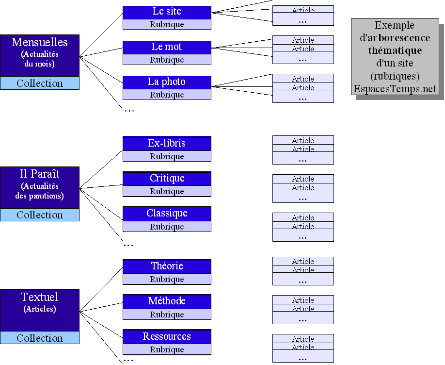
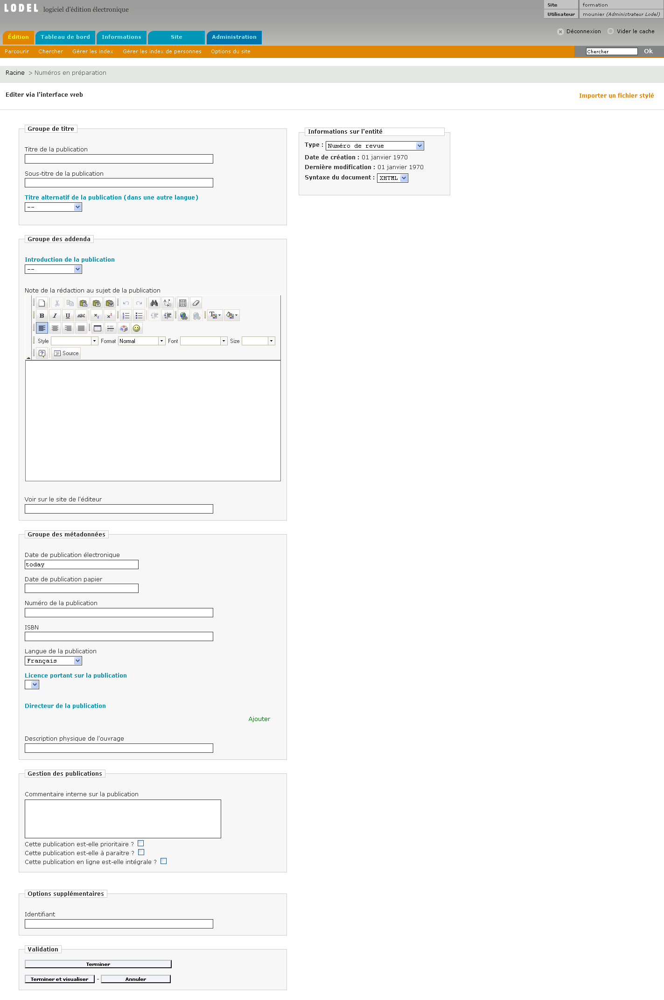

PRÉSENTATION GÉNÉRALE
-----------------------

Remarque préalable : les fonctions de gestion du site (la création de publications par exemple) sont accessibles à partir
du niveau **éditeur**.

La page d’accueil de l’interface d’édition permet:
  * de créer la structuration du site en créant des publications emboîtées (on parle également d'arborescence).
  * d'ajouter des documents à des publications, situées à divers niveaux de l'arborescence. Ces documents peuvent être 
   de différents types selon le modèle éditorial adopté.
   
Les menus déroulants « Ajouter » permettent d'ajouter des publications ou des documents. Ils ouvrent, selon le cas, la fenêtre 
de création d'une publication, la fenêtre de saisie d'un document ou la fenêtre d'importation d'un document.

**Barre de menus « Ajouter »**

---------------------------------------------------

### MISE EN PLACE DE L'ARBORESCENCE DU SITE

##### 1ÉRE ÉTAPE : PENSER L'ARBORESCENCE

Avant d’entreprendre la réalisation d’un site, il convient d’en penser l’arborescence documentaire. Selon le type de modèle éditorial choisi, divers types de publications et de documents sont proposés. Il s’agit avant tout de penser la hiérarchie des publications avant de les créer.

Les deux entités essentielles du site sont les documents et les publications.

* Les documents constituent le contenu principal du site : articles d’une revue, comptes rendus, notes de lecture, informations          pratiques dans le cas du modèle éditorial d'OpenEdition Journals.
* Les publications contiennent les textes : les numéros d’une revue, les journées d’un colloque, les rubriques d’un blog.

C’est en jouant essentiellement avec ces deux types d’objet, qu’on va pouvoir construire l’arborescence de son site. Celui-ci ne doit pas, sauf exception, être pensé comme un livre, construit à partir d’une succession de chapitres, mais plutôt comme une sorte d’armoire remplie de boîtes, éventuellement contenues les unes dans les autres, contenant pour finir les documents que l’on cherche à ranger. Dans le modèle éditorial d'OpenEdition Journals, les boîtes les plus grandes, qui contiennent toutes les autres sont des collections. A l’intérieur de ces collections, on peut placer directement des documents, ou plus généralement des conteneurs de plus petite taille – des rubriques, des numéros de revue, des sous-parties contenant eux-mêmes des documents.

Plusieurs modèles d’organisation peuvent être adoptés. Le portail OpenEdition Journals qui publie des revues de sciences humaines avec Lodel, connaît deux grands types d’organisation documentaires :

* des sites où les contenus sont organisés à l’intérieur de numéros de revues :

**Organisation documentaire en numéros de revues**

* et des sites dont l’organisation documentaire repose sur des rubriques permanentes

**Organisation documentaire en rubriques**

On peut imaginer beaucoup d’autres types d’organisation des contenus à l’intérieur d’un site. Ces deux exemples ont pour objectif de montrer qu’il est à la fois possible de varier les modes d’organisation et nécessaire de les penser en amont.

Si on comprend bien la nécessité d’utiliser plusieurs types de conteneurs – de publications dans le vocabulaire utilisé par Lodel, on peut se demander pourquoi utiliser plusieurs types de documents.

Les types de textes permettent de distinguer les textes entre eux, de leur faire subir des traitements différents, et de leur affecter une mise en forme (par le biais de templates) adaptée. En effet, à chaque type d’objet éditorial est associé un template, c'est-à-dire un modèle graphique de document. Ainsi, les articles peuvent avoir une mise en forme différente des comptes rendus, eux-mêmes différents des textes d’actualité et des éditoriaux. Les types de textes sont également utilisés dans les sommaires ou dans les index, pour procéder à des classements automatiques. 

#### 2ÈME ÉTAPE : CRÉER L'ARBORESCENCE

Pour développer l’arborescence du site, on crée des publications dans lesquelles on pourra dans un second temps ranger les documents. Au niveau de la page d’accueil de l’interface d’édition, on choisit le type de publication à créer (dans le menu déroulant « publications »). S'ouvre alors une page d'édition des métadonnées de la publication en cours de création.

**Page de création et d’édition d’une publication**

On remplit les champs (titre, langue, date de publication, icône, titre alternatif dans une autre langue, etc.), en suivant les consignes affichées, puis on termine.

Si l’on souhaite créer une sous-publication, il faut se placer à l’intérieur de celle-ci en cliquant sur le titre de la publication parente. Grâce au menu déroulant, on peut à nouveau créer une publication, en suivant la même procédure que celle décrite ci-dessus.

On peut ainsi créer de multiples publications emboîtées. En haut de la page, sous les onglets de navigation, le fil d’Ariane rappelle la position de la publication créée dans l’arborescence du site.

--------------------------------------------------------------

### STRUCTURE DU SITE ET CHAMPS DANS LE MODÈLE ÉDITORIAL D'OPENEDITION JOURNALS

Les modèles éditoriaux mettent en place de contraintes sur les types de structuration qu’ils autorisent. Ils interdisent ainsi les structurations absurdes (un numéro de revue dans une sous-partie par exemple), ou qui ne sont pas souhaitées. Le modèle éditorial d'OpenEdition Journals repose sur un nombre limité de règles simples :

 * Les « collections » sont nécessairement définies à la racine de l’arborescence documentaire du site.
 * Les « numéros » et « rubriques » ne peuvent pas être créées à la racine du site.
 * Les « sous-parties » se trouvent uniquement dans les numéros et les rubriques
 * Les « textes » ne peuvent se trouver à la racine du site
 * Les « fichiers » ne peuvent être placés à la racine du site
 * Les « personnes » ne peuvent être insérées qu’au sein de publications de type « Equipe »
 
C’est l’application des règles du modèle éditorial qui explique que certains types de publications ou de documents ne sont pas disponibles et ne peuvent être créés selon l’endroit où l’on se trouve dans l’arborescence du site.

Dans la page d’édition des publications, le bloc de « Gestion des publications » est propre au modèle éditorial d'OpenEdition Journals. Il permet de transmettre des informations qui, si elles sont utilisées par la maquette, déclenchent des affichages spécifiques.

**Bloc de gestion des publications**

* « Cette publication est-elle prioritaire ? » Dans les maquettes conçues par OpenEdition Journals, cette option permet de faire remonter la publication à la « Une » de la page d’accueil du site.
* « Cette publication est-elle à paraître ? » Dans les maquettes conçues par OpenEdition Journals, cette option permet d’afficher le numéro des revues à paraître dans la barre de navigation, sous l’intitulé adéquat.
* « Cette publication est-elle en texte intégral ? » Dans les maquettes conçues par le Cléo, cette option permet de signaler dans la barre de navigation que ce numéro est en libre accès et n’est pas dans la barrière mobile.

### Droits d'auteur

© tous droits réservés
